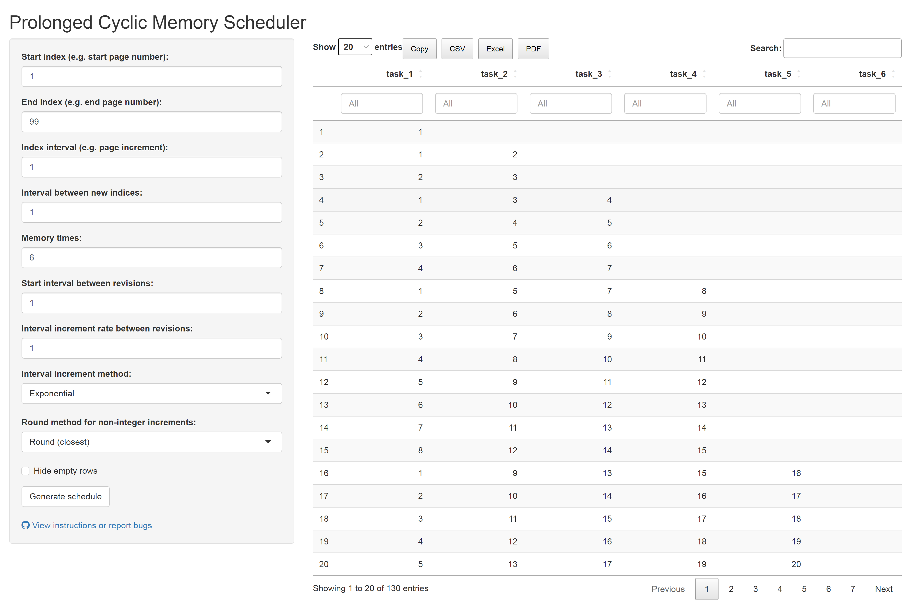

Prolonged Cyclic Memory Scheduler
================

- <a href="#introduction" id="toc-introduction">Introduction</a>
- <a href="#implementation" id="toc-implementation">Implementation</a>
- <a href="#instructions" id="toc-instructions">Instructions</a>

## Introduction

It is common in our life that we need to memorize words, notes,
quantities, etc. Efficient memory of them comes in handy in daily life.
One of such method is prolonged cyclic memory, where one regularly
review previous memory tasks after prolonged intervals for a certain
number of times. Here, [an
application](https://zxr6.shinyapps.io/prolong_cyclic_scheduler/) is
presented to help generate schedules for such memory scheme.

## Implementation

Prolonged cyclic memory is implemented as follows. For a certain memory
task, it is reviewed after a series of (usually exponentially) prolonged
time, such as 1, 2, 4, 8 and 16 days, for 6 times in total (1 memory and
5 revisions). After a regular interval (such as 1 day), a new memory
task is added to the schedule in the same way. Therefore, the schedule
may look like this:

- Day 1: memorize task 1.
- Day 2: review task 1 and memorize task 2.
- Day 3: review task 2 and memorize task 3.
- Day 4: review task 1 & 3 and memorize task 4.
- …

[This application](https://zxr6.shinyapps.io/prolong_cyclic_scheduler/)
schedules memory tasks with the following flexibility:

- Task indices: may be customized with start, end and interval.
- Memory times: may be customized to determine total times of memory and
  revisions.
- Memory interval: may be customized with initial interval, prolongation
  rate (including non-integer rates) and method
  (exponentially/linearly); for non-integer rates, round method may
  further be specified (round/floor/ceiling).

For prolongation methods, the underlying mathematics are as follows,
with initial interval `a`, prolongation rate `r` and round function `f`:

- Exponential prolongation: intervals before the `i`th revision is
  `f(a * r^(i - 1))`.
- Linear prolongation: intervals before the `i`th revision is
  `f(a + r * (i - 1))`.

## Instructions

[This application](https://zxr6.shinyapps.io/prolong_cyclic_scheduler/)
looks like this:

<!-- -->

The panel on the left size is control panel, with the following features
for customization:

- **Start index**, **end index** & **index interval**: determine the
  indices of memory tasks, usually page indices.
- **Interval between indices**: determine the interval before a new
  memory task is added.
- **Memory times**: determine the total times of memory and revision.
- **Start interval** & **interval increment**: determine the start
  interval before the first revision and its increment rate; non-integer
  (positive) increment rate is acceptable.
- **Interval increment method**: determine the way the revision interval
  is incremented (options: exponential and linear).
- **Round method**: determine the way the task is rounded in the case of
  non-integer increment (options: round, floor and ceiling, meaning:
  closest, advanced and delayed scheduling).
- **Hide empty rows**: determine whether days (or batches) with no
  memory or revision tasks should be hidden; hidden rows are detectable
  from row indices to the left of the schedule.
- **Generate schedule**: click this button to generate or update
  schedule.

The panel on the right is schedule panel, where the schedule is
generated by clicking the **Generate schedule** button in the control
panel. You may adjust the page length to view the schedule, perform
filtration and sorting on the schedule, and export the schedule in view
to various formats, including clipboard, comma-separated values (CSV),
Excel or PDF. For example, page length is selected as 20 in the page
length menu (to the left above the schedule’s header) in the screenshot,
and 20 rows are exported if one of the four buttons to the right are
clicked under this setting. You may select **All** in the page length
menu to show and export the whole schedule. You may filter and sort the
schedule using the textboxes under the schedule’s header and the arrows
to the right of the schedule’s header, respectively.
